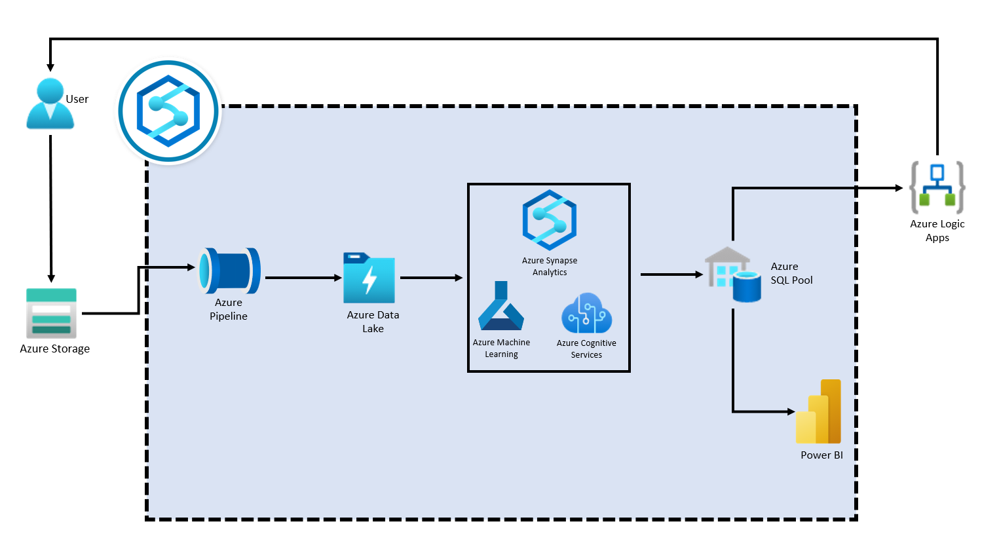

## About this Repository 
This accelerator was built to provide developers with all of the resources needed to build a solution to forecast prices of commodities and identify anomalies in the time-series data using Azure Synapse Analytics, Azure Machine Learning and Azure Cognitive Services.

## Prerequisites
In order to successfully complete this solution accelerator, you will need to have access to and/or provisioned the following: 
1. Azure Subscription 
2. Azure Storage Explorer

## Azure Analytics Platforms 
The directions provided for this solution assume fundamental working knowledge of Azure, Azure Cognitive Services, Azure Machine Learning and Power BI. 
1. [Azure Synapse Analytics](https://azure.microsoft.com/en-us/services/synapse-analytics/)
2. [Azure Cognitive Services](https://azure.microsoft.com/en-us/services/cognitive-services/)
3. [Azure Machine Learning Services](https://azure.microsoft.com/en-us/services/machine-learning/)
4. [Power BI](https://docs.microsoft.com/en-us/power-bi/)

## Getting Started and Process Overview 
1. Clone the repository and navigate to the root of the directory 
2. Go to [Deployment Guide](./Resource_Deployment/ResourceDeployment.md)
The architecture diagram below details what you will be building for this Solution Accelerator. 

## 0 - Resource Deployment 
The resources in this folder can be used to deploy the required resources into your Azure Subscription. You can do this in the Azure Portal. 

## 1 - Analytics Deployment
This folder contains the Notebooks needed to complete this solution accelerator. Once you have deployed all the required resources from [ResourceDeployment.md](./Resource_Deployment/ResourceDeployment.md). Run through the Notebooks following the instructions in [Resource Deployment](./Resource_Deployment/README.md). 

## Contributing

This project welcomes contributions and suggestions.  Most contributions require you to agree to a
Contributor License Agreement (CLA) declaring that you have the right to, and actually do, grant us
the rights to use your contribution. For details, visit https://cla.opensource.microsoft.com.

When you submit a pull request, a CLA bot will automatically determine whether you need to provide
a CLA and decorate the PR appropriately (e.g., status check, comment). Simply follow the instructions
provided by the bot. You will only need to do this once across all repos using our CLA.

This project has adopted the [Microsoft Open Source Code of Conduct](https://opensource.microsoft.com/codeofconduct/).
For more information see the [Code of Conduct FAQ](https://opensource.microsoft.com/codeofconduct/faq/) or
contact [opencode@microsoft.com](mailto:opencode@microsoft.com) with any additional questions or comments.

## Trademarks

This project may contain trademarks or logos for projects, products, or services. Authorized use of Microsoft 
trademarks or logos is subject to and must follow 
[Microsoft's Trademark & Brand Guidelines](https://www.microsoft.com/en-us/legal/intellectualproperty/trademarks/usage/general).
Use of Microsoft trademarks or logos in modified versions of this project must not cause confusion or imply Microsoft sponsorship.
Any use of third-party trademarks or logos are subject to those third-party's policies.
