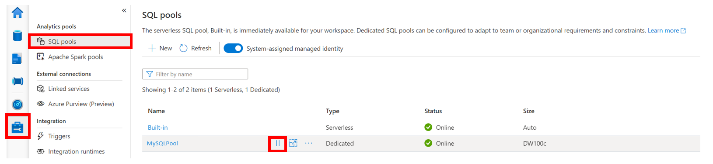

# Deployment Guide 
We are currently working on an automated deployment process for this solution accelerator. Until this becomes available, here is the Manual Deployment Guide for deploying the Solution Accelerator. 

## Step 1: Create Azure Synapse Analytics 
In this step you will deploy a Resource Group, Azure Synapse Analytics and a Spark Pool in the Synapse workspace, an Azure Data Lake (Gen2) Storage Account, an Azure Machine Learning Service and an Azure Cognitive Service Anomaly Detector into the Azure Subscription you are using for this solution accelerator.

### Parameters
Below are parameters you will use to create the necessary resources for this solution accelerator.

- **Subscription**: Azure Subscription Id
- **Resource Group**: Name of the resource group to create
- **Resource Name**: a globally unique name for creating the resources (must be 3-10 characters)
- **Username**: SQL user for Synapse workspace
- **Password**: SQL user for Synapse workspace (must be at least 8 characters)
- **Location**: the location to deploy all the resources
* **Note**: You will be installing the Azure CLI extension for Azure Synapse

1. Open PowerShell as Administrator
2. Navigate to this folder `Resource_Deployment\`
3. Run the following command: `./deployment_script.ps1`
4. Follow the prompts.
- **NOTE**: Be sure to manually pause the SQL pool when you are not using it from the Synapse Workspace to reduce cost. Follow the steps below to pause the SQL pool:  
	- Navigate to the Synapse workspace
	- Go to `Manage` > `SQL pools` > Pause the SQL pool 
	- 

### Step 1.1 Deploy Azure Machine Learning
1. Once the above script finishes, go to the Azure Portal and deploy a Azure Machine Learning Services resource into the resource group that you are using for this Solution Accelerator.
	* You can search for `Machine Learning` after clicking on `Create a resource` to get the correct resource.
	* **NOTE**: Along with the service comes the following:
	* Azure Key Vault
	* Azure Storage
	* Azure Application Insights
	* Azure Container Registry
		- Click "Create new", provide a name and click "save"  
2. Go the Azure Machine Learning service 
3. Go to the Access Control (IAM)
4. Click "+ Add"
5. Click "Add role assignment" 
6. Now click the Role dropdown and select `Contributor` and search for your Azure Synapse Analytics Workspace name 

Click "Save" at the bottom. 

- Follow the steps in this [Quickstart - Creating a Synapse Workspace.](https://docs.microsoft.com/en-us/azure/synapse-analytics/get-started-create-workspace) Pick a name for all the resources that is inline with the customer's policy.
- Follow the steps in this [How-to Guide - Create a Workspace](https://docs.microsoft.com/en-us/azure/machine-learning/how-to-manage-workspace?tabs=azure-portal#create-a-workspace)

### Step 1.2 Create Azure Cognitive Service Anomaly Detector 
1. Go to the Azure Portal and deploy an Anomaly Detector resource into the resource group that you are using for this Solution Accelerator. 
	* You can search for `Anomaly Detector` after clicking on `Create a resource` to get the correct resource. 
	* Select your Azure Subscription, resource group,  provide a unique name and a pricing tier for the Anomaly Detector. Click "Review + create" > "Create" 

### Step 1.3 Create Storage Account Directory
In this step you will create a folders in the storage account container to store the source dataset and the results of the pipelines and predictions
1. Go to the Azure Data Lake Storage Account created in Step 1
2. Go to the Container you have previously created
3. Click "Add Directory" and add the following folders
	- CommodityAggrData
	- Source
	- Result
		- /Anomalies
		- /Scored

* **NOTE**: This step is required for Step 6 

## Step 2 Create a Logic App
In order to send mails when anomalies are found we need to create a Logic App.

1. Create the Logic app. Follow the steps in this [Quickstart - Create your logic app](https://docs.microsoft.com/en-us/azure/logic-apps/quickstart-create-first-logic-app-workflow#create-your-logic-app)
2. Once the Logic App is created, go to the resource and select the Logic Apps Designer
3. Pick the trigger "When a HTTP request is received"
4. Paste the JSON schema below in the Request Body JSON Schema and choose POST for the method
```JSON
	{
	    "properties": {
	        "dfName": {
	            "type": "string"
	        },
	        "eventTime": {
	            "type": "string"
	        },
	        "mailto": {
	            "type": "string"
	        },
	        "message": {
	            "type": "string"
	        },
	        "pipelineName": {
	            "type": "string"
	        },
	        "subject": {
	            "type": "string"
	        }
	    },
	    "type": "object"
	}
```
5. Add a new step to the Logic App, called “Send an email”. We will use Office 365 (Outlook), but it's also possible to use another E-mail provider.
6. If this is the first time you connect an Office 365 account on Azure, you need to connect your Office 365 account to Azure by signing in. (Note: allow pop-ups in your browser.)


7. After you signed in, you’ll see the following screen.


8. The fields will be filled in dynamically based on the JSON schema we added in our start trigger. To do this you need to click “See more”. Now you see all the available variables.
9. Fill in all the fields like the screenshot below.
    - **Note**: you will need to click "Add new parameter" to add `Importance` and set the field to `High`


10. Click "Save" in the top left. 
11. Finally an endpoint URL for the Logic Apps was created.  Retrieve that URL from the first step. Copy this URL to a notepad for a later step.


## Step 3: Create Azure Key Vault Linked Service in Azure Synapse Analytics 

### Step 3.1: Azure Key Vault Permissions 
In order for Azure Synapse Analytics to connect to the key vault, you have to grant the Synapse workspace permission. 
1. Go to the Key Vault deployed with your Azure Machine Learning service in Step 1.
2. Go to `Access policies`, click "+ Add Access Policy", under `Secret permissions` select `List` and `Get` from the dropdown, under `Select principal` click "None selected", search for your Synapse workspace name to be added to the Key Vault, select "Save" and click "Add".
	- Repeat this step to add your username: click "+ Add Access Policy", under `Secret permissions` select `List`, `Get` and `Set` from the dropdown, under `Select principal` click "None selected", search for your username to be added to the Key Vault, select "Save" and click "Add".
3. Click "Save" at the top of the screen

### Step 3.2 Create Key Vault Secret for your Anomaly Detector 
1. Go to the Anomaly Detector deployed in Step 1.2
2. Click `Key and Endpoint` and copy Key 1
3. Go to the Key Vault deployed with your Azure Machine Learning service. 
4. Click on `Secrets` under Settings and click "+ Generate/Import"  
5. Provide a name and the value of the access key from the Anomaly Detector created in Step 1.2 and click "create" 

### Step 3.3: Create Linked Service 
1. Navigate to the Synapse workspace: 
2. Go to `Manage` > `Linked Service` > "+ New" 
	* Select "Azure Key Vault"
	* Provide the linked service a name 
	* Select the subscription and key vault name you are using for this accelerator > Click "continue"
3. Click "Publish all" and confirm the assets to be published  

## Step 4: Upload the Notebooks to the Synapse Workspace

### Step 4.1: Upload Notebooks and SQL Scripts
1. Navigate to the Synapse workspace: 
2. Go to `Develop`, click the "+" and click "Import": 
    * In the demo's repository, go to `Analytics_Deployment\synapse-workspace\notebooks` to select all of the Spark Notebooks
3. Click "+" and click "Import":
	* in this demo's repository, go to `Analytics_Deployment\synapse-workspace\SQL Scripts` to select the `Create Table.sql` script.
4. Edit the notebooks: 
	* In the notebook `01_Training`, edit the following: 

	```
	subscription_id = ""
	resource_group = ""
	workspace_name = ""
	data_lake_account_name = ""
	file_system_name = ""
	```
	* In the notebook `02_Scoring`, edit the following: 

	```
	subscription_id = ""
	resource_group = ""
	workspace_name = ""
	data_lake_account_name = ""
	file_system_name = ""
	```
	* In the notebook `03_AnomalyDetection`, edit the following:

	```
	data_lake_account_name = "" 
	file_system_name = ""
	linked_service = "" # Azure Key Vault Linked Service name 
	akv_name = "" # Azure Key Vault name 
	secret_name = "" # Azure Key Vault Secret name 
	anomaly_location = "" # Azure Cognitive Service Region
	```

	* In the notebook `04_GenerateForecast`, edit the following: 

	```
	data_lake_account_name = ""
	file_system_name = "" 
	```

5. Click Publish and confirm the assets to be published

### Step 4.2: Create Table for Synapse Workspace
1. In the Synapse Workspace, go to "Develop" and open `Create Table.sql` script, click the "connect to" dropdown, and click the dedicated SQL pool name created in step 1
2. Click "Run"


## Step 5: Create Linked Service
For this solution accelerator we are using an Azure Open Dataset. To learn more about this data set please visit [Azure Open Dataset](https://azureopendatastorage.blob.core.windows.net)
The source data that we use is stored on a Azure Public Storage account. To retrieve that dataset in the pipelines, we need to add a Linked Service in the Synapse Workspace.
1. In the Synapse Workspace, go to "Manage" - "Linked Services" and click the "+ New".
2. Select Azure Blob Storage and click continue
3. Provide the name `AzureOpenDataStorage` for the linked service
4. Select Authentication Method "SAS URI"
5. Paste `https://azureopendatastorage.blob.core.windows.net` in the SAS URL field
6. Past `r""` in the SAS Token Field
7. Click Test Connection. You should receive "Connection Successful"
8. Click Commit to save the linked service


## Step 6: Create Datasets
* Create the following Azure Data Lake Storage and Azure Blob Storage datasets that will be used later in the pipelines.
	- Go to the Synapse Workspace and click "Data" 
		- Click "Linked" and click the "+" and  choose "Integration Dataset" to create the following datasets 

| Data Store        | Type           | Linked Service | Name | File System | Directory | File | Import Schema | 
| ----------------- |:--------------:| --------------:| ---- | --------- | --------- | --------- | --------- |
| Azure Data Lake Storage Gen2| Parquet| Workspace Default Storage | Anomalies | {your_container_name} | Result/Anomalies| N/A | Default Schema |
| Azure Data Lake Storage Gen2| Parquet| Workspace Default Storage | CommodityData |{your_container_name} | CommodityAggrData| N/A | Default Schema |
| Azure Data Lake Storage Gen2| Parquet| Workspace Default Storage | PII_CommodityLocal | {your_container_name} | Source | N/A | Default Schema |
| Azure Data Lake Storage Gen2| Parquet| Workspace Default Storage | Scored | {your_container_name} |Result/Scored | N/A | Default Schema |
| Azure Blob Storage| Parquet| AzureOpenDataStorage | ppi_commodity | laborstatisticscontainer |ppi_commodity | N/A | Default Schema |

* Create the following Azure Synapse Analytics datasets that will be used later in the pipelines.
	- Go to the Synapse Workspace and click "Data" 
		- Click "Linked" and click the "+" and  choose "Integration Dataset" to create the following datasets 
* **Note**: When you create the `AnomaliesTable`, `ScoredTable` and `ForecastTable`, click the refresh to the right of the dropdown, under `Value` enter your SQL Pool Name and click "Ok". 
	* Once the Integrated Dataset AnomaliesTable and ScoredTable have been created, Under `DBName` enter your SQL Pool name into the `Value`

| Data Store        |  Linked Service  | Name | Table Nale | Import Schema |
| ----------------- | --------------| ---- | --------- | --------- | 
| Azure Synapse Analytics | Workspace Default Storage | AnomaliesTable | Anomalies | Default Schema |
| Azure Synapse Analytics| Workspace Default Storage | ScoredTable | Scored | Default Schema |
| Azure Synapse Analytics | Workspace Default Storage | ForecastTable | Forecast | Default Schema |

* Click Publish and confirm the assets to be published

## Step 7: Set Up Copy Data Pipeline
For this solution accelerator, we are using data provided by [Azure Open Datasets](https://azure.microsoft.com/en-us/services/open-datasets/catalog/us-producer-price-index-commodities/). 
1. In the Synapse Workspace, go to "Integrate" and click the "+", and choose "Pipeline". 
2. In the Properties window, change the name to  `Copy data from azureopendatastorage to Synapse ADLS`
3. Click the "{}" button at the top right corner to open the Code window
4. Copy and paste the contents of `Analytics_Deployment\synapse-workspace\pipelines\CopyDataFromAzureOpenDataStorage.json`
5. Click OK to apply.
6. Click "Publish All" > "Publish"  
7. Trigger the `Copy data from azureopendatastorage to Synapse ADLS` pipeline 
	* In the designer, click "Add Trigger" > "Trigger Now" 

## Step 8: Set up Filter and Aggregate Source Data Pipeline 
In this step you will prepare the data to train the model
1. In the Synapse Workspace, go to "Integrate" and click the "+", and choose "Pipeline". 
2. In the Properties window, change the name to `Filter and Aggregate Source Data`
3. Click "Move & transform", and drag and drop the "Data flow" into the designer
	* Under General provide the Data flow the following name `CopyAndFilter_DF` 
	* Click Settings and click "+ New" to create a new data flow
	* Provide the following name to the new Data flow with the following name `CopyAndFilter_DF` 
4. Click the "{}" button at the top right corner to open the Code window
5. Copy and paste the contents of `Analytics_Deployment\synapse-workspace\pipelines\CopyAndFilter_DF.json`
6. Click OK to apply. 
7. Click "Publish All" > "Publish"  
8. Trigger the `Filter and Aggregate Source Data` pipeline 
	* In the designer, click "Add Trigger" > "Trigger Now" 

## Step 9: Run the Notebooks 
In this step you will run the notebooks from Step 4. 
1. Go to the Synapse workspace and click on "Develop" and run each notebook in order: 
	* `01_Training`
	* `02_Scoring`
	* `03_AnomalyDetection`
	* `04_GenerateForecast`
2. After all the notebooks have been run, you will have a machine learning model for price predictions and identify anomalies in price discrepancies. 

## Step 10: Set up the Anomaly Pipeline 
In this step you will set up the anomaly detection pipeline. This pipeline will trigger an email to be sent when an anomaly is detected in your time-series data.  This step assumes you have already run the `03_AnomalyDetection.ipynb` in step 9. 
* **Note**: You will need to manually connect each object in the pipeline. 

1. In the Synapse Workspace, go to "Integrate", click the "+", and choose "Pipeline" 
	*  Under Properties provide the pipeline with the following name `Anomaly`
	*  Under Parameter of the Pipeline, add the following parameters
		* emailto > Type string > {Enter_your_email_address}
		* subject > Type string > {Enter_subject}
		* message > Type string > {Ente_message}
2. Click "Synapse", drag and drop the "Notebook" into the designer
	* Provide a name for the Notebook object
	* Click the Settings tab > Notebook dropdown > `03_AnomalyDetection.ipynb`
3. Click "Move & transform", drag and drop the "Data flow" into the designer and provide the Data flow the following name `Copy Anomalies To SQL Pool`
	* Click Settings, under "Staging linked service" and choose the default storage linked service from the dropdown 
	* Under "Staging storage folder", use the following folder path: {your_container_name}/Results
	* Under Settings and click "+ New" to create a new data flow 
	* Under Properties provide the Data flow the following name `Copy Anomalies To SQL Pool`
4. Click the "{}" button at the top right corner to open the Code window
5. Copy and paste the contents of `Analytics_Deployment\pipelines\CopyAnomalyToSQLPool.json` 
6. Click OK to apply. 
7. Click "General", drag and drop the "Lookup" into the designer
	* Provide the following name `Lookup Anomalies` for the Lookup object
	* Under Settings, select the `AnomaliesTable` for the source dataset 
		* Set Use Query to query 
		* Under Query provide the following query `select * from anomalies where isAnomaly='True'`
		* Set Query timeout to 120 
		* Isolation level set to "none" 
		* Partition option set to "none" 
		* Select First row only 
8. Click "Iteration and conditions", drag and drop "If condition" into the designer
	* Provide a name to the If condition object 
	* Under Activites provide the following query to Expression `@contains(activity('Lookup Anomalies').output,'firstRow')`
	* Set Case > True, edit the Activity
	* Click "General", drag and drop the "Web" object into the designer
		* Provide the Web object a name 
		* Under Settings, provide the Logic App URL created in Step 4 to the URL field 
		* Set Method to "POST" 
		* Provide the follow query to the Body field  `{"dfName":"@{pipeline().Pipeline}","eventTime":"@{utcnow()}","mailto":"@{pipeline().parameters.emailto}","message":"@{pipeline().parameters.message}","pipelineName":"@{pipeline().TriggerName}","subject":"@{pipeline().parameters.subject}"}`
	* Set Case > False, edit the Activity 
	* Click "General", drag and drop the "Wait" object into the designer 
		* Provide the Wait Object a name 
		* Under "Settings", set "Wait time in seconds" to `1`
9. Click "Publish All" > "Publish" 
10. Trigger the pipeline
	* In the designer, click "Add Trigger" > "Trigger Now". The final pipeline should look like: 


## Step 11: Set Up Scoring Pipeline: 
1. In the Synapse workspace, go to "Integration", click "+" and choose Pipeline
2. Under Properties provide the pipeline with the following name `Copy Score to SQL Pool`
3. Click the "{}" button at the top right corner to open the Code window
4. Copy and paste the contents of `Analytics_Deployment\pipelines\CopyScoreToSQLPipeline.json`
5. Click OK to apply.
6. Click "Publish All" > "Publish"
7. Trigger the `Copy Score to SQL Pool` pipeline 
	* In the designer, click "Add Trigger" > "Trigger Now" 

## Step 12: Set up Forecasting Pipeline
1. In the Synapse workspace, go to 'Integration", click "+" and choose Pipeline
2. Under Properties provide the pipeline with the following name `Generate Forecast Pipeline`
3. Click the "{}" button at the top right corner to open the Code window 
4. Copy and paste the contents of `Analytics_Deployment\pipelines\GenerateForecastPipeline.json`
5. Click OK to apply.
6. Trigger the `Generate Forecast Pipeline` pipeline
	* In the designer, click "Add Trigger" > "Trigger Now" 